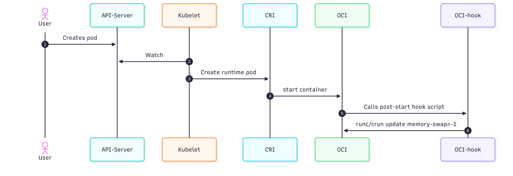
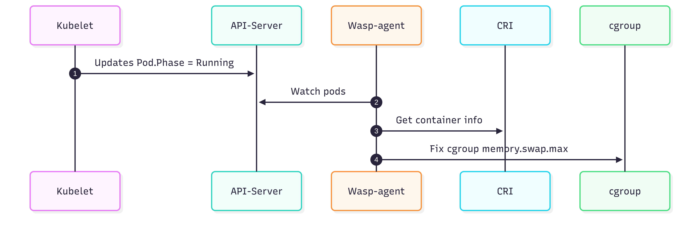

# wasp-agent Architecture

## Overview

wasp-agent provides a non-intrusive method to enable LimitedSwap for OpenShift
pod containers. It replicates the functionality described in
[KEP-2400](https://github.com/kubernetes/enhancements/tree/master/keps/sig-node/2400-node-swap)
without requiring changes to the kubelet API or the activation of experimental
feature gates.

## Motivation

Traditional virtualization platforms (e.g., RHEV, VMware vSphere) leverage
memory overcommitment and swap to achieve high VM density. While OpenShift
Virtualization supports memory overcommitment, its dependency on KEP-2400 for
swap support presents a challenge. Because KEP-2400 remains in an experimental
state, enabling it in production OpenShift clusters is prohibited, as it risks
cluster stability and prevents future upgrades.

### Goals

- Provide LimitedSwap functionality as described in KEP-2400 without requiring
  the experimental swap feature-gate.
- Design the solution for seamless transition to the Kubernetes-native
  LimitedSwap implementation once it reaches GA.

### Non-Goals

- Unlimited swap memory usage.
- Swap only for VM pods.
- Protecting workloads from high swap activity.
- Platforms other than OpenShift.
- Single-node clusters.
- Compact clusters (schedulable infra nodes).
- Hosted control planes.

## User Stories

- As a cluster administrator I want to enable swap for VM workload pods so I
  can achieve higher VM density on my cluster.
- As a cluster administrator I want to keep my swap-enabled cluster
  upgradeable.
- As a cluster administrator I want to move my swap-enabled cluster to native
  Kubernetes swap once it reaches GA without observing any regression related
  to swapping.

## Design

To implement swap support independently of the kubelet, wasp-agent intercepts
the pod creation phase and enforces swap limits that persist throughout the pod
lifecycle. We evaluated the Node Resource Interface (NRI) and OCI runtime hooks
for lifecycle integration and selected OCI hooks due to their established
maturity and broad adoption in the ecosystem.

When the OCI runtime calls the OCI hook it passes pod information to the hook
via stdin. However the information lacks several things: pod memory requests,
pod priority, and the QoS classification. Filtering based on QoS classification
is still possible at the hook level because each QoS class has a dedicated
cgroup hierarchy in the cgroupfs. The container cgroup path is parsed from
stdin and its QoS class is derived from the path.

To fully comply with KEP-2400 a multi-phased approach is used:

1. **OCI hook** — filter based on QoS class, set unlimited swap.
2. **Controller** — watch running pods and fix the swap value if necessary.

The wasp-agent controller uses an informer to read pod information from the API
server.

### Direct Manipulation of cgroupfs

Using the OCI hook it is possible to write the `max` value to the
`memory.swap.max` interface file. However in the OpenShift platform both
kubelet and CRI-O are configured to use the systemd cgroup driver.

The initial assumption was that swap values would be set only once during the
container lifecycle, at its creation phase and before the application starts.
That assumption proved wrong — systemd's cgroup driver can re-apply the full
set of values to the container cgroupfs hierarchy upon resource update requests.
One such case is when the CPU manager static policy is enabled: resource update
requests can arrive at any stage of the container lifecycle.

### Prestart vs. Poststart

To sync the swap value with systemd the d-bus client must be used. At the same
time the hook implementation is kept as simple as possible without introducing
delays or performance issues. When the OCI runtime executes a resource update
to a running container it triggers the d-bus client and systemd is synced with
the new values. The OCI runtime needs to read an internal container state file
for the update, and this file does not yet exist when a prestart hook is called.
Therefore the hook runs in **poststart** state.

### Short-Lived Containers

The poststart hook timing means container PID 1 is already running when the
hook executes. Some deployments have containers with a very short lifetime (e.g.
a single-line init-container that copies a file). A race condition exists
between hook execution and systemd cgroup teardown — the update fails because
the cgroupfs no longer exists.

To handle this, the hook captures and analyzes the execution return code. On
error, it checks whether the PID still exists; if not, it silently exits. The
assumption is that the memory footprint of short-lived containers is low enough
that enabling swap for them is not critical.

### OCI Hook Deployment

For hook injection CRI-O requires specific configuration. The wasp-agent
controller is responsible for deploying:

- **OCI hook configuration JSON** — the hook descriptor.
- **Hook executable shell script** — the actual hook implementation.

Starting with OpenShift 4.20, `runc` was replaced by `crun`. This affects the
hook script which uses the OCI runtime tool to update resources. For backward
compatibility wasp-agent detects the effective OCI runtime from CRI-O
configuration and renders the hook script accordingly. This dynamic detection
rules out using the Machine Config Operator for deployment, which would require
maintaining different hook file versions mapped to OpenShift versions.

The controller also handles OCI file cleanup before termination. To ensure
cleanup is mutually exclusive with subsequent file creations by other instances
on the same node, OCI files are suffixed with the current wasp-agent pod name.

### Swap Limit Fix-Up

The OCI hook does not have the full picture of the pod spec. Still, the
application must be able to use swap before it starts, with the swap limit
corrected later. The wasp-agent controller handles this fix-up using go-client
to list running pods.

Since the controller action is node-local, it only lists pods running on the
same node. The go-client is configured with a field selector matching the node
name.

For consistency the controller continuously relists all running pods and
performs the fix if needed — a reconciliation loop for the swap memory limit.
The fix is applied directly to `memory.swap.max` in the cgroup. Interacting
with the d-bus client or OCI runtime for the update would complicate the
implementation and risk racing with kubelet.

To calculate the cgroup path, the controller uses the CRI-O CRI API to fetch
the container host PID, then reads the path from `/proc/<PID>/cgroup`.

## Deployment

The following Kubernetes resources are required:

| Resource | Purpose |
|---|---|
| Namespace | Isolation for wasp-agent components |
| DaemonSet | Deploy wasp-agent on every worker node |
| ServiceAccount | Identity for the wasp-agent pods |
| Role | RBAC permissions (list pods) |
| RoleBinding | Bind the role to the service account |
| SecurityContextConstraint | Privileged access for OCI file and cgroup operations |

Since swapping is supported only on worker nodes, wasp-agent is deployed as a
DaemonSet. The application needs list permissions on Pod resources.

From a pod security perspective wasp-agent performs the following privileged
operations:

- Install and clean OCI files.
- Communicate with CRI-O via the gRPC unix socket.
- Write values to the cgroupfs.

wasp-agent is considered a system-critical pod because of the swap limit
fix-up; its pod priority is adjusted accordingly.

## Alternatives Considered

### Kubernetes Swap (KEP-2400)

At the time of this proposal Kubernetes swap is still graduating; its usage
requires a feature gate. Enabling it makes an OpenShift cluster
non-upgradeable.

### NRI (Node Resource Interface)

NRI is a well-deserved candidate as an alternative to OCI hooks. The OCI
approach was chosen due to feature maturity and proven usage in other solutions.

## Upgrade / Rollback Compatibility

**Upgrade:** Installing wasp-agent takes immediate effect. Existing workload
resource limits are updated with new swap memory limits. If swap is not
provisioned, default behavior is preserved.

**Rollback:** To opt out, workloads must be restarted to restore the previous
behavior (no swap).

### Upgrading to Kubernetes Swap GA

During the upgrade the target OpenShift version should:

1. Discontinue deploying wasp-agent.
2. Opt in for Kubernetes swap.

The transition is seamless — workloads continue consuming swap memory on the
newly upgraded nodes.

## Testing

Functional testing follows the same approach as KEP-2400, running on the
OpenShift platform using OpenShift CI.
